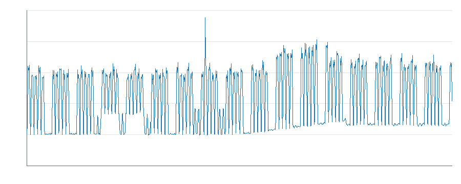
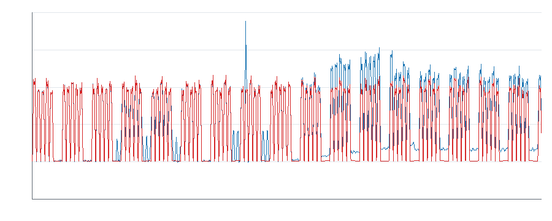
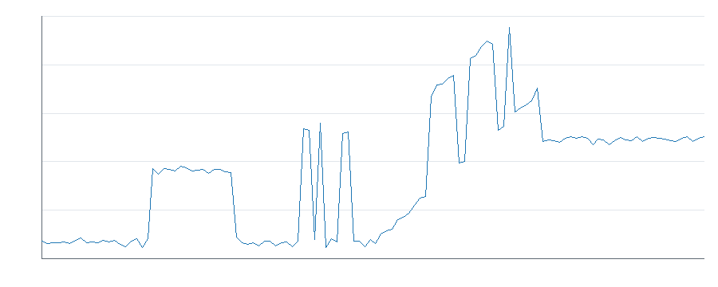
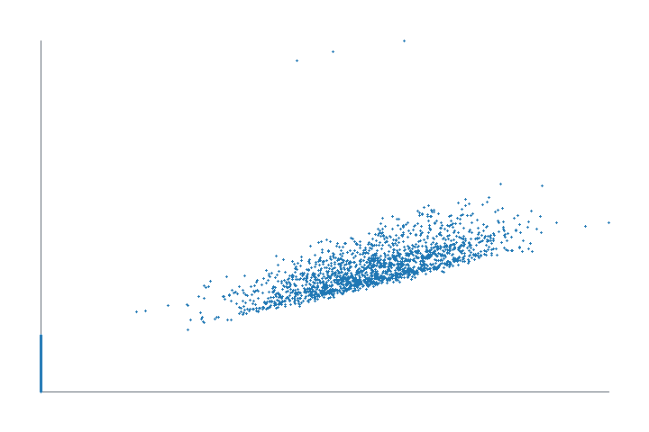

# Pre-diagnostic energetique agentique — demonstration

## 1. Resume executif

Trois comportements sont confirmes par les donnees : une derive progressive de la charge fixe, une baisse temporaire d'efficacite a production comparable et un nouveau niveau de charge inactive persistant. Trois autres signaux (nuit, week-end et pic ponctuel) meritent une verification operationnelle.

Les kWh ci-dessous sont des surconsommations observees par rapport a une baseline, pas des economies garanties. Aucun total portefeuille ni projection annuelle n'est publie, car certaines fenetres se chevauchent et la part recuperable est inconnue.

## 2. Donnees analysees

- Periode couverte (fin exclue) : 2026-01-05T00:00:00 -> 2026-05-05T00:00:00.
- Mesures valides : 11515 quarts d'heure.
- Energie totale : 153 411,4 kWh.
- Production : 143 191,6 unites.
- Variables de controle : production active, temperature exterieure, shift et type produit.

## 3. Qualite des donnees

Couverture estimee : 99,957 %. Le chargeur a trace 1 timestamp invalide, 1 mesure manquante, 1 valeur impossible et 1 doublon strict. Les quatre trous sont localises ; ils ne coincident pas avec les longues tendances conservees.

## 4. Profil energetique

La consommation hors production atteint 41 708,1 kWh (27,2 %). Elle inclut une charge de base legitime et ne constitue pas en bloc une economie.

## 5. Baseline

La baseline retenue utilise production, temperature, activite, type produit B et interaction production-produit. Elle est calibree sur le passe puis validee sur la periode suivante.

- Validation MAE : 1,237 kW.
- Validation RMSE : 1,558 kW.
- Validation R2 : 0,9968.

## 6. Investigations realisees

H01 a H06 ont suivi observation -> hypothese -> test -> contre-hypothese -> nouveau test -> quantification -> decision. H07 et H08 ont ete explicitement rejetes pour confusion et double comptage. Le detail complet se trouve dans `reports/investigation.json`.

## 7. Opportunites confirmees

### #1 — H06 : nouveau niveau de charge inactive

5 979,0 kWh sur la periode, soit 1 046,33 EUR au tarif de 0,175 EUR/kWh.

Le residu inactif moyen reste a 8,30 kW sur 30/30 jours. La temperature n'en explique que 0,168 kW.

Ce que les donnees demontrent : un changement durable de niveau existe hors production.

Ce qu'elles ne demontrent pas : l'equipement responsable ni la part arretable.

A verifier : nouvelles utilites, consignes, fuites, ventilation, pompes ou maintien en temperature.

### #2 — H05 : derive progressive de charge fixe

4 232,3 kWh sur la periode, soit 740,65 EUR au tarif de 0,175 EUR/kWh.

Pente inactive : 0,414 kW/j (R2 0,992). La pente imputable a la temperature est 0,0015 kW/j.

Ce que les donnees demontrent : la charge fixe se degrade progressivement, y compris a production nulle.

A verifier : encrassement, fuite croissante, derive de regulation et auxiliaire restant charge.

### #3 — H04 : baisse temporaire d'efficacite

2 123,7 kWh sur la periode, soit 371,65 EUR au tarif de 0,175 EUR/kWh.

Apres retrait de la derive fixe, l'ecart actif passe de 0,11 a 12,18 kW, sur 11/11 jours. Production et mix produit sont comparables.

Ce que les donnees demontrent : davantage de puissance est necessaire pour une production comparable.

Ce qu'elles ne demontrent pas : la cause mecanique exacte.

## 8. Efficacite energetique

Le signal mensuel d'intensite n'est pas conserve comme opportunite autonome : mai ne contient que quatre jours et le ratio recouvre H04-H06. L'analyse a production comparable est plus solide.

## 9. Impact economique

Les couts ci-dessus portent uniquement sur les periodes observees. La review de chevauchement trouve 1 119,1 kWh sur des timestamps communs ; H04 retranche H05, mais aucun total global n'est affiche sans allocation causale. Aucune annualisation n'est effectuee.

## 10. Opportunites necessitant verification

- H01 nuit : 2 152,8 kWh sur la periode, soit 376,74 EUR au tarif de 0,175 EUR/kWh. Recurrence 15/15 jours, production nulle.
- H02 week-end : 877,3 kWh sur la periode, soit 153,53 EUR au tarif de 0,175 EUR/kWh. Recurrence 4/4 jours, production nulle.
- H03 pic ponctuel : 239,2 kWh sur la periode, soit 41,86 EUR au tarif de 0,175 EUR/kWh. Un seul evenement de deux heures ; pas d'annualisation.

### H01 — prochaine verification minimale

- A demander : Demander au responsable de site quels equipements ou utilites devaient rester actifs entre 00:00 et 05:00 pendant les 15 nuits concernees.
- Pourquoi : Une liste courte des usages nocturnes permet de distinguer un besoin de procede d'un equipement reste actif par habitude ou erreur de consigne.
- Valeur informationnelle : elevee: la reponse peut faire passer la piste de reservee a rejetee ou a test terrain.
- Hypotheses departagees : charge nocturne necessaire au procede / charge nocturne non requise ou consigne incorrecte.
- Responsable pressenti : responsable de site.
- Effort client : Entretien de 10 minutes, sans mesure ni arret d'equipement. (tres_faible).
- Attendu si l'hypothese est vraie : Si la charge est non requise, aucun usage nocturne obligatoire ne sera identifie pour expliquer le palier observe.
- Cause physique : non etablie avec les donnees disponibles.

### H02 — prochaine verification minimale

- A demander : Verifier dans le planning si maintenance, nettoyage ou production non comptabilisee avait lieu pendant les quatre jours de week-end identifies.
- Pourquoi : Le planning existant suffit a tester l'explication operationnelle la plus probable avant toute visite ou instrumentation.
- Valeur informationnelle : elevee: le planning peut expliquer completement les quatre occurrences sans nouvelle mesure.
- Hypotheses departagees : activite de week-end legitime mais absente de la production / charge de week-end sans activite planifiee.
- Responsable pressenti : responsable de production ou maintenance.
- Effort client : Lecture du planning et reponse oui/non, environ 5 minutes. (tres_faible).
- Attendu si l'hypothese est vraie : Si la charge est anormale, le planning ne montrera ni maintenance, ni nettoyage, ni production pendant ces quatre jours.
- Cause physique : non etablie avec les donnees disponibles.

### H03 — prochaine verification minimale

- A demander : Demander ce qui s'est passe le jour et pendant les deux heures exactes du pic: demarrage, essai, incident, maintenance ou aucune operation connue.
- Pourquoi : Le journal ou la memoire de l'operateur permet de separer un evenement normal et necessaire d'un incident ou d'une valeur capteur douteuse.
- Valeur informationnelle : moyenne: la reponse peut classer le pic comme operation legitime, incident ou mesure douteuse.
- Hypotheses departagees : operation ponctuelle legitime / incident energetique ou mesure capteur erronee.
- Responsable pressenti : operateur present ou responsable de production.
- Effort client : Question de 5 minutes a l'operateur; aucun test terrain demande. (tres_faible).
- Attendu si l'hypothese est vraie : Si le pic correspond a un incident energetique, l'operateur signalera un fonctionnement inhabituel plutot qu'un demarrage planifie.
- Cause physique : non etablie avec les donnees disponibles.

## 11. Hypotheses rejetees importantes

- H07 : l'intensite de mai n'est ni comparable ni independante.
- H08 : le signal de pointe et H03 couvrent exactement les memes huit points ; les additionner doublerait 239,2 kWh.

## 12. Recommandations

Aucune cause physique n'est etablie par ce dataset. Les actions ci-dessous sont des verifications, pas des diagnostics d'equipement ni des investissements prescrits.

### R-H01 — H01

- Anomalie mesurée : Hausse nocturne bornee du residu de puissance.
- Impact observé : 2 152,8 kWh, 376,74 EUR sur 2026-01-25/2026-02-09.
- Confiance : medium.
- Causes plausibles classées : 1. utilité nocturne nécessaire (untested) ; 2. consigne ou équipement maintenu sans besoin (untested).
- Cause physique : plausible mais non prouvée ; aucune économie récupérable publiée.
- Prochaine vérification : Demander au responsable de site quels equipements ou utilites devaient rester actifs entre 00:00 et 05:00 pendant les 15 nuits concernees.
- Responsable : responsable de site.
- Effort : Entretien de 10 minutes, sans mesure ni arret d'equipement..
- Attendu si l'hypothèse est vraie : Si la charge est non requise, aucun usage nocturne obligatoire ne sera identifie pour expliquer le palier observe.
- Mesure après intervention : puissance moyenne ou énergie sur la même fenêtre comparable, au moins trois occurrences comparables après intervention; succès = effet cohérent avec une prédiction pré-enregistrée et hors variabilité de référence.

### R-H02 — H02

- Anomalie mesurée : Charge de jour sur quatre jours de week-end consecutifs.
- Impact observé : 877,3 kWh, 153,53 EUR sur 2026-02-19/2026-03-06.
- Confiance : medium.
- Causes plausibles classées : 1. maintenance ou nettoyage (untested) ; 2. charge de week-end non planifiée (untested).
- Cause physique : plausible mais non prouvée ; aucune économie récupérable publiée.
- Prochaine vérification : Verifier dans le planning si maintenance, nettoyage ou production non comptabilisee avait lieu pendant les quatre jours de week-end identifies.
- Responsable : responsable de production ou maintenance.
- Effort : Lecture du planning et reponse oui/non, environ 5 minutes..
- Attendu si l'hypothèse est vraie : Si la charge est anormale, le planning ne montrera ni maintenance, ni nettoyage, ni production pendant ces quatre jours.
- Mesure après intervention : puissance moyenne ou énergie sur la même fenêtre comparable, au moins trois occurrences comparables après intervention; succès = effet cohérent avec une prédiction pré-enregistrée et hors variabilité de référence.

### R-H03 — H03

- Anomalie mesurée : Huit quarts d'heure consecutifs depassent la baseline de plus de 80 kW.
- Impact observé : 239,2 kWh, 41,86 EUR sur 2026-02-24T10:00/2026-02-24T12:00.
- Confiance : low.
- Causes plausibles classées : 1. opération ponctuelle légitime (untested) ; 2. incident ou mesure capteur erronée (untested).
- Cause physique : plausible mais non prouvée ; aucune économie récupérable publiée.
- Prochaine vérification : Demander ce qui s'est passe le jour et pendant les deux heures exactes du pic: demarrage, essai, incident, maintenance ou aucune operation connue.
- Responsable : opérateur présent.
- Effort : Question de 5 minutes a l'operateur; aucun test terrain demande..
- Attendu si l'hypothèse est vraie : Si le pic correspond a un incident energetique, l'operateur signalera un fonctionnement inhabituel plutot qu'un demarrage planifie.
- Mesure après intervention : puissance moyenne ou énergie sur la même fenêtre comparable, au moins trois occurrences comparables après intervention; succès = effet cohérent avec une prédiction pré-enregistrée et hors variabilité de référence.

### R-H04 — H04

- Anomalie mesurée : Le residu actif augmente sans hausse equivalente du residu inactif.
- Impact observé : 2 123,7 kWh, 371,65 EUR sur 2026-03-16/2026-03-31.
- Confiance : high.
- Causes plausibles classées : 1. dégradation du procédé (untested) ; 2. recette, cadence ou qualité non mesurée (untested).
- Cause physique : plausible mais non prouvée ; aucune économie récupérable publiée.
- Prochaine vérification : Comparer le journal de production et les changements de recette, cadence ou réglage pendant les 11 jours concernés avec les 15 jours précédents.
- Responsable : responsable de production.
- Effort : 20 à 30 minutes sur les journaux existants.
- Attendu si l'hypothèse est vraie : Si l'efficacité s'est réellement dégradée, aucun changement de recette, cadence ou exigence qualité suffisant ne coïncidera avec les 11 jours.
- Mesure après intervention : puissance moyenne ou énergie sur la même fenêtre comparable, au moins trois occurrences comparables après intervention; succès = effet cohérent avec une prédiction pré-enregistrée et hors variabilité de référence.

### R-H05 — H05

- Anomalie mesurée : Le residu inactif augmente progressivement pendant trente jours.
- Impact observé : 4 232,3 kWh, 740,65 EUR sur 2026-03-06/2026-04-05.
- Confiance : high.
- Causes plausibles classées : 1. fuite d'air comprimé (untested) ; 2. dérive de régulation (untested) ; 3. autre auxiliaire fixe (untested).
- Cause physique : plausible mais non prouvée ; aucune économie récupérable publiée.
- Prochaine vérification : Lors d'un prochain arrêt autorisé, relever pendant 30 minutes la pression réseau et le nombre de démarrages compresseur sans ouvrir de vanne ni modifier de sécurité.
- Responsable : responsable maintenance.
- Effort : 30 minutes pendant un arrêt déjà planifié.
- Attendu si l'hypothèse est vraie : Si l'air comprimé contribue à la dérive, le compresseur cyclera ou la pression baissera mesurablement sans demande de production.
- Mesure après intervention : puissance moyenne ou énergie sur la même fenêtre comparable, au moins trois occurrences comparables après intervention; succès = effet cohérent avec une prédiction pré-enregistrée et hors variabilité de référence.

### R-H06 — H06

- Anomalie mesurée : Apres la derive, un niveau residuel inactif reste durablement eleve.
- Impact observé : 5 979,0 kWh, 1 046,33 EUR sur 2026-04-05/2026-05-05.
- Confiance : high.
- Causes plausibles classées : 1. nouveau besoin légitime (untested) ; 2. consigne modifiée (untested) ; 3. auxiliaire maintenu actif (untested).
- Cause physique : plausible mais non prouvée ; aucune économie récupérable publiée.
- Prochaine vérification : Lister les équipements, consignes, travaux ou exigences d'exploitation ajoutés ou modifiés autour du début exact du nouveau palier.
- Responsable : responsable de site avec maintenance.
- Effort : entretien de 15 minutes et consultation du journal de travaux.
- Attendu si l'hypothèse est vraie : Si le palier est involontaire, aucun nouveau besoin permanent suffisant ne sera documenté à sa date d'apparition.
- Mesure après intervention : puissance moyenne ou énergie sur la même fenêtre comparable, au moins trois occurrences comparables après intervention; succès = effet cohérent avec une prédiction pré-enregistrée et hors variabilité de référence.

## 13. Limites

Dataset synthetique, quatre mois, tarif simple, aucune mesure par equipement et aucune preuve de causalite physique. Les surconsommations ne sont pas des economies garanties.

## 14. Methodologie

Validation et normalisation deterministes, baseline passee->future, residualisation, comparaisons contextuelles, recherche d'explications alternatives, quantification Python, review adversariale Codex et controle des chevauchements.
